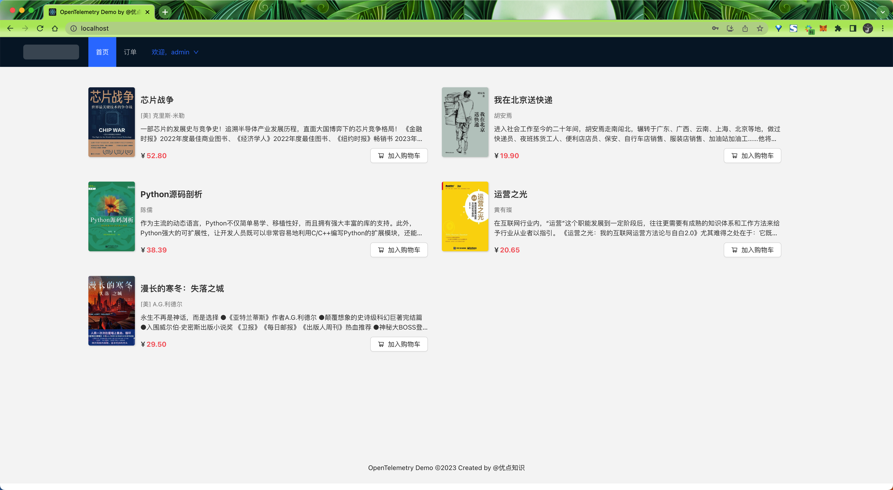
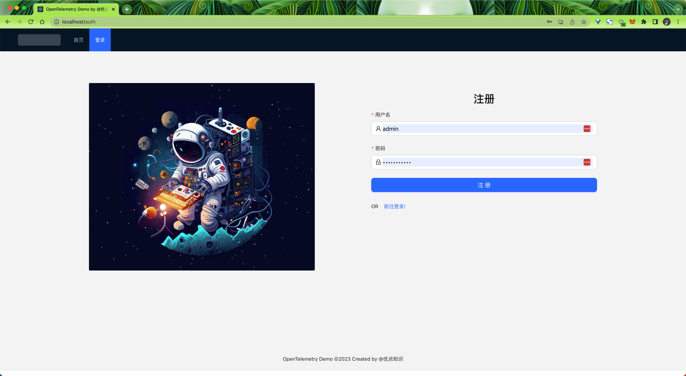
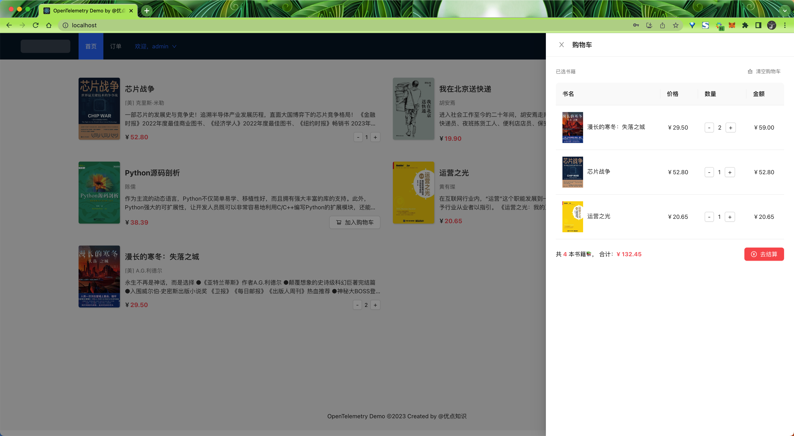
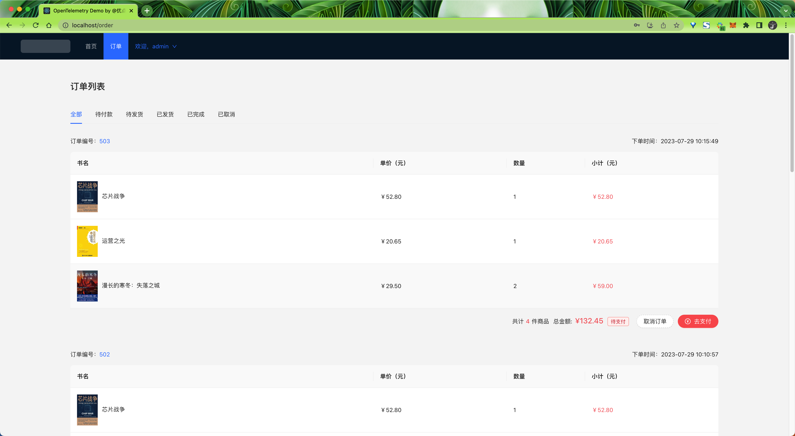

# Pod Demo

该项目是一个简单的微服务应用，用于演示在 Kubernetes、Istio、gRPC、DevOps、GitOps、OpenTelemetry 等技术的使用，该应用程序适用于任何 Kubernetes 集群，部署起来很容易，几乎不需要任何配置，也可以使用 Docker Compose 一键启动。

主要包含以下几个微服务：

- **Frontend (React)**：提供用户界面，用户可以在此浏览和购买书籍。
- **Book Catalog Service (Node.js)**：提供书籍的信息，如标题、作者、价格等。
- **Order Service (Java)**：处理订单创建、状态更新等。
- **Payment Service (Python)**：处理支付事务。
- **Inventory Service (Golang)**：跟踪书籍库存（待定...）。
- **User Service (Golang)**：处理用户信息（如用户登录、注册等）。
- **Database (MySQL)**：存储书籍信息、订单数据、库存数据、用户信息等。

第一个版本是应用的基础功能，后续会逐步增加新的功能。

## 使用

为了方便，这里我们使用 Docker Compose 来启动这些服务，所以需要先安装 Docker、Docker Compose。

安装完成后，你可以在项目根目录下执行以下命令来启动这些服务：

```bash
$ docker-compose up -d
```

正常可以看到以下运行的几个服务：

```bash
$ docker-compose ps
NAME                        COMMAND                  SERVICE             STATUS              PORTS
book-app-catalogservice-1   "/nodejs/bin/node ma…"   catalogservice      running             8082/tcp
book-app-db-1               "docker-entrypoint.s…"   db                  running             0.0.0.0:3306->3306/tcp, :::3306->3306/tcp
book-app-frontend-1         "/docker-entrypoint.…"   frontend            running             0.0.0.0:80->80/tcp, :::80->80/tcp
book-app-orderservice-1     "java -jar /usr/app/…"   orderservice        running             8081/tcp
book-app-payservice-1       "/usr/bin/python3.9 …"   payservice          running             8083/tcp
book-app-userservice-1      "/app/main"              userservice         running             8080/tcp
```

启动后，你可以在浏览器中访问 [http://localhost](http://localhost) 来查看这个应用。



第一次使用可以注册一个账号：



注册登录完成后，就可以在首页的书籍列表中选购书籍了：



在订单列表中可以查看到自己的订单：



如果想要更改代码，可以使用开发模式的 Docker Compose 文件来启动服务：

```bash
$ docker-compose -f docker-compose.dev.yml up
```

这样就可以在本地修改代码，而且修改代码后每个服务都会自动重启生效的，非常方便。然后直接在浏览器中访问 [http://localhost:3000](http://localhost:3000) 就可以看到修改后的效果了。
